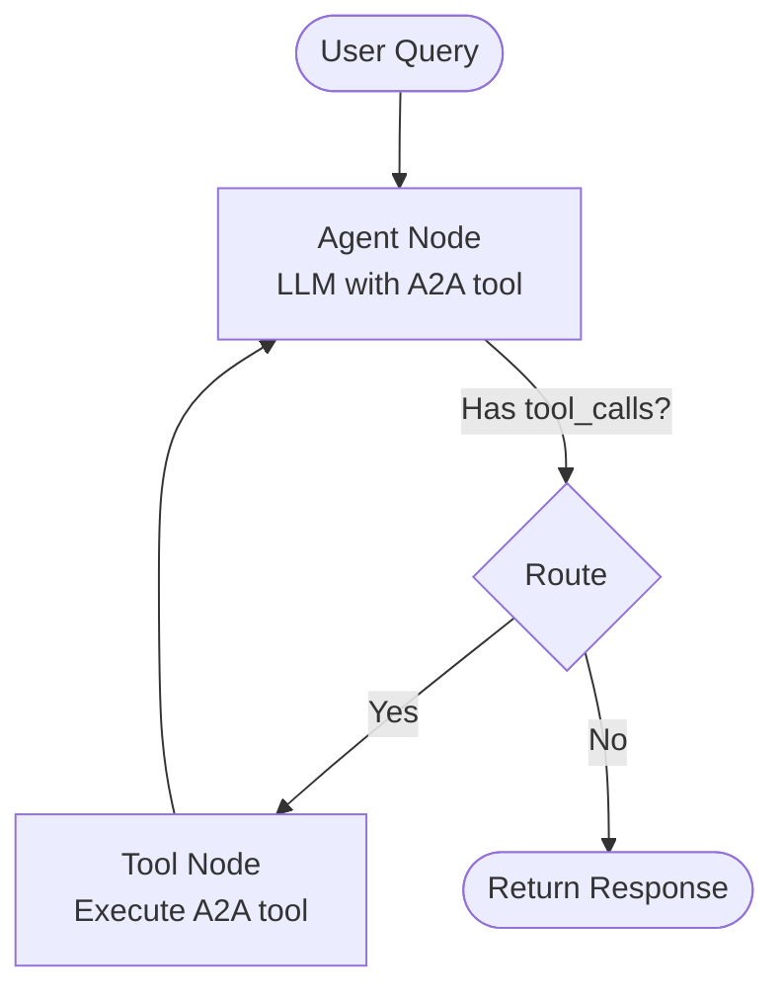

# Simple A2A Agent - LangGraph Example

A straightforward demonstration of using **LangGraph** to create an agent that communicates with an A2A (Agent-to-Agent) server using the A2A protocol.

## Overview

This simple agent shows the core concept: **using LangGraph to make API calls to an Agent Node through the A2A protocol**.

### What It Does

```
User Query → Simple Agent → A2A Protocol → Server Agent → Response
```

The simple agent:
1. Receives a question from the user
2. Uses LangGraph to decide if it needs help from the A2A server
3. Calls the server agent via A2A protocol
4. Returns the response to the user

## Directory Structure

```
simple_agent/
├── __init__.py          # Package exports
├── a2a_tool.py          # A2A protocol tool (~70 lines)
├── graph.py             # LangGraph definition (~75 lines)
├── agent.py             # Simple agent class (~90 lines)
└── run.py               # Test/demo script (~110 lines)
```

**Total: ~345 lines** - Simple and easy to understand!

## Quick Start

### 1. Prerequisites

Make sure you have the environment set up:

```bash
# Your .env file should have:
OPENAI_API_KEY=your_key_here
TOOL_LLM_NAME=gpt-4o-mini
```

### 2. Start the A2A Server

In one terminal:

```bash
cd 15_A2A_LangGraph
uv run python -m app
```

You should see:
```
INFO:     Uvicorn running on http://0.0.0.0:10000
```

### 3. Run the Simple Agent

In another terminal:

```bash
# Command line mode
uv run python simple_agent/run.py "What are the latest AI developments?"

# Interactive mode
uv run python simple_agent/run.py
```

## Usage Examples

### Example 1: Command Line

```bash
$ uv run python simple_agent/run.py "Search for quantum computing news"

======================================================================
Simple A2A Agent
======================================================================

✓ Agent initialized successfully
✓ A2A server is running at http://localhost:10000

======================================================================

Query: Search for quantum computing news

Response:
----------------------------------------------------------------------
Based on recent web search results, here are the latest developments
in quantum computing... [response from A2A server agent]
----------------------------------------------------------------------
```

### Example 2: Interactive Mode

```bash
$ uv run python simple_agent/run.py

======================================================================
Simple A2A Agent
======================================================================

✓ Agent initialized successfully
✓ A2A server is running at http://localhost:10000

======================================================================

Interactive mode - Enter your questions (or 'quit' to exit)

You: Find papers about transformers

Agent: Based on a search of arXiv, here are recent papers about
transformer architectures... [response from A2A server]

You: quit

Goodbye!
```

## How It Works

### Architecture

```
┌─────────────────────────────────────────┐
│         User Query                       │
└──────────────┬──────────────────────────┘
               ▼
┌─────────────────────────────────────────┐
│    Simple Agent (LangGraph)              │
│                                          │
│  ┌────────────────────────────────┐    │
│  │  Agent Node (LLM)              │    │
│  │  - Decides: Use A2A tool?      │    │
│  └────────┬───────────────────────┘    │
│           │                              │
│           ▼                              │
│  ┌────────────────────────────────┐    │
│  │  Tool Node                     │    │
│  │  - query_a2a_agent()           │    │
│  └────────┬───────────────────────┘    │
└───────────┼──────────────────────────────┘
            │
            │ A2A Protocol (HTTP/JSON)
            ▼
┌─────────────────────────────────────────┐
│    A2A Server Agent                      │
│    - Web search (Tavily)                 │
│    - Academic papers (arXiv)             │
│    - Document retrieval (RAG)            │
└─────────────────────────────────────────┘
```

### LangGraph Flow



### Code Flow

1. **`run.py`** - Entry point
   - Initializes the agent
   - Handles user input
   - Displays responses

2. **`agent.py`** - SimpleAgent class
   - Creates the LLM (OpenAI)
   - Builds the graph
   - Provides `run()` method

3. **`graph.py`** - LangGraph definition
   - Agent node: LLM decides to use tool
   - Tool node: Executes A2A tool
   - Routing: tool_calls? → tools : end

4. **`a2a_tool.py`** - A2A protocol tool
   - Uses `a2a-sdk` to call server
   - Formats messages per A2A protocol
   - Handles errors

## Key Files Explained

### a2a_tool.py

The core A2A communication:

```python
@tool
def query_a2a_agent(question: str) -> str:
    """Send a question to the A2A server agent."""
    # Create A2A client
    client = AgentClient(A2A_SERVER_URL, http_client)

    # Format message per A2A protocol
    message = {
        'message': {
            'role': 'user',
            'parts': [{'kind': 'text', 'text': question}],
            'message_id': uuid4().hex,
        }
    }

    # Send and return response
    response = client.send_message(message)
    return extract_text(response)
```

### graph.py

Simple LangGraph with two nodes:

```python
def create_simple_graph(llm):
    # Bind tool to LLM
    llm_with_tools = llm.bind_tools([query_a2a_agent])

    # Agent node
    def agent_node(state):
        return {"messages": [llm_with_tools.invoke(state["messages"])]}

    # Routing
    def should_continue(state):
        if last_message.tool_calls:
            return "tools"
        return "end"

    # Build graph: agent → tools → agent (loop)
    graph.add_conditional_edges("agent", should_continue)
    graph.add_edge("tools", "agent")
```

### agent.py

Minimal agent class:

```python
class SimpleAgent:
    def __init__(self):
        self.llm = ChatOpenAI(...)
        self.graph = create_simple_graph(self.llm)

    def run(self, query: str) -> str:
        inputs = {"messages": [("user", query)]}
        result = self.graph.invoke(inputs)
        return result["messages"][-1].content
```

## Configuration

### Environment Variables

```bash
# Required
OPENAI_API_KEY=your_openai_api_key

# Optional (defaults shown)
A2A_SERVER_URL=http://localhost:10000
TOOL_LLM_NAME=gpt-4o-mini
TOOL_LLM_URL=https://api.openai.com/v1
```

### Modify A2A Server URL

```bash
export A2A_SERVER_URL=http://your-server:port
```

## Using in Your Code

### Basic Usage

```python
from simple_agent import SimpleAgent

# Create agent
agent = SimpleAgent()

# Ask a question
response = agent.run("What is quantum computing?")
print(response)
```

### With Conversation Memory

```python
# Same thread_id maintains conversation context
agent.run("Search for AI papers", thread_id="conversation-1")
agent.run("Which is most relevant?", thread_id="conversation-1")
```

### Access Message History

```python
response, history = agent.run_with_history(
    "Tell me about LangGraph",
    thread_id="my-thread"
)

print(f"Response: {response}")
print(f"Messages in history: {len(history)}")
```

## Troubleshooting

### "Cannot connect to A2A server"

**Solution**: Start the server first:
```bash
uv run python -m app
```

### "Error initializing agent"

**Solution**: Check your `.env` file has `OPENAI_API_KEY`:
```bash
cat .env | grep OPENAI_API_KEY
```

### Agent not using A2A tool

**Reason**: The query might be too simple for the LLM to think it needs help.

**Solution**: Make queries more explicit:
- Instead of: "Tell me about AI"
- Try: "Search the web for latest AI news"

## What's NOT Included

To keep it simple, this implementation does NOT have:

- ❌ Streaming responses
- ❌ Async/await
- ❌ Multiple tools
- ❌ Helpfulness evaluation loop
- ❌ Complex CLI features
- ❌ Fancy error handling

This is intentional! The focus is on demonstrating the core concept clearly.

## Comparison: Simple vs Complex

| Feature | Simple Agent | v2 Agent (Complex) |
|---------|--------------|-------------------|
| **Lines of Code** | ~345 | ~1,260 |
| **Files** | 5 | 6 + docs |
| **Streaming** | No | Yes |
| **Async** | No | Yes |
| **Tools** | 1 (A2A only) | 2 (standard + streaming) |
| **CLI Features** | Basic | Advanced |
| **Graph Complexity** | Simple loop | With helpfulness eval |
| **Documentation** | Concise | Comprehensive |
| **Purpose** | Learning/Demo | Production-ready |

## Extending the Simple Agent

### Add More Tools

Edit `graph.py`:

```python
from simple_agent.a2a_tool import query_a2a_agent
from my_tools import my_custom_tool

llm_with_tools = llm.bind_tools([query_a2a_agent, my_custom_tool])
```

### Add System Prompt

Edit `agent.py`:

```python
from langchain_core.messages import SystemMessage

def run(self, query: str, thread_id: str = "default") -> str:
    inputs = {
        "messages": [
            SystemMessage(content="You are a helpful assistant..."),
            ("user", query)
        ]
    }
    # ... rest of code
```

### Enable Streaming

Modify `agent.py`:

```python
def stream(self, query: str, thread_id: str = "default"):
    inputs = {"messages": [("user", query)]}
    config = {"configurable": {"thread_id": thread_id}}

    for chunk in self.graph.stream(inputs, config):
        yield chunk
```

## Key Takeaways

✅ **Simple**: Only ~345 lines total
✅ **Clear**: Easy to understand LangGraph structure
✅ **Functional**: Demonstrates A2A protocol usage
✅ **Modular**: Well-organized file structure
✅ **Extensible**: Easy to add features

## Next Steps

1. **Try it out**: Run the examples above
2. **Understand the flow**: Read through the code files
3. **Modify it**: Add your own tools or features
4. **Compare**: Check out the v2 implementation for production features

## Related Files

- **Server Agent**: `app/` directory - The A2A server this agent calls
- **v2 Agent**: Branch `s15-A2A-langgraph-v2` - More sophisticated implementation
- **A2A SDK**: Used by `a2a_tool.py` for protocol communication

## Summary

This simple agent demonstrates the **core assignment requirement**:

> "Build a LangGraph Graph to use your application by creating a Simple Agent
> that can make API calls to the Agent Node through the A2A protocol."

✅ Uses **LangGraph** for the agent graph
✅ Makes **API calls** through the A2A protocol
✅ Queries the **Agent Node** (A2A server)
✅ Keeps it **simple** and understandable

Perfect for learning and demonstrating A2A agent communication!
